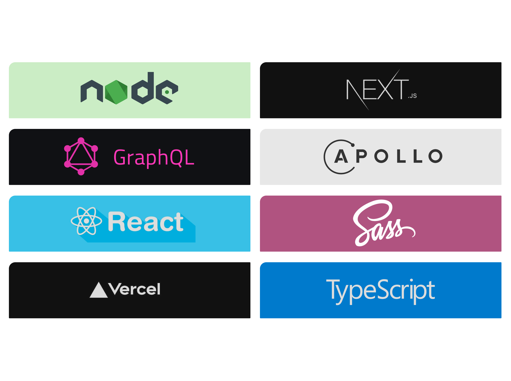

<p style="text-align:center">
    <a href = "">Lightfilms demo vision</a>
</p>

<div style = "display: flex; box-sizing: border-box; margin-top: 10px; align-items: center; justify-content: space-evenly; width: 100%; padding-left: 10%; padding-right: 10%;" >
    <a href = "">Next.js</a>
    <a href = "">TypeScript</a>
    <a href = "">React</a>
    <a href = "">GraphQL</a>
    <a href = "">SASS</a>
    <a href = "">Apollo</a>
</div>
<div style = "display: flex; box-sizing: border-box; margin-top: 50px; align-items: center; justify-content: space-evenly; width: 100%; padding-left: 10%; padding-right: 10%; padding-bottom: 120px;" >
    <p style="text-align:center; margin-top: 80px; width: 420px;">
        Lightfilms - A project written in Typescript ReactJS based on the framework Next.JS and deployed on Vercel
    </p>
</div>

# Setup

```sh
    $git clone https://github.com/ssandry/lightfilms.git
    $cd lightfilms
```

<br />
<br />

# Scripts

<br />

## dev

Перед тем как начать `npm run dev` пожалуйста поеняйте `process.env.MODE=production` на `process.env.MODE=development` в `.env.local`. После чего можно начать `npm run dev`. (Без данных действий `NodeJS` будет выдавать ошибку)

```sh
    $npm run dev
```

```sh
    $yarn dev
```

<br />

## build

Скрипт `build` используется в `Next.js` чтобы собрать продакшен версию проекта, которая будет быстрее и качественне чем если бы был `$npm run dev`

```sh
    $npm run build
```

```sh
    $yarn build
```

<br />

## start 

Скрипт `start` используется чтобы запустить собранный посредством скрипта `npm run build` проект

```sh
    $npm run start
```

```sh
    $yarn start
```

<br />
<br />

# More

<p>
    <a href = "">Next.JS</a>
</p>
<p>
    <a href = "">GraphQL</a>
</p>
<p>
    <a href = "">TypeScript.JS</a>
</p>
<p>
    <a href = "">SCSS | SASS</a>
</p>

