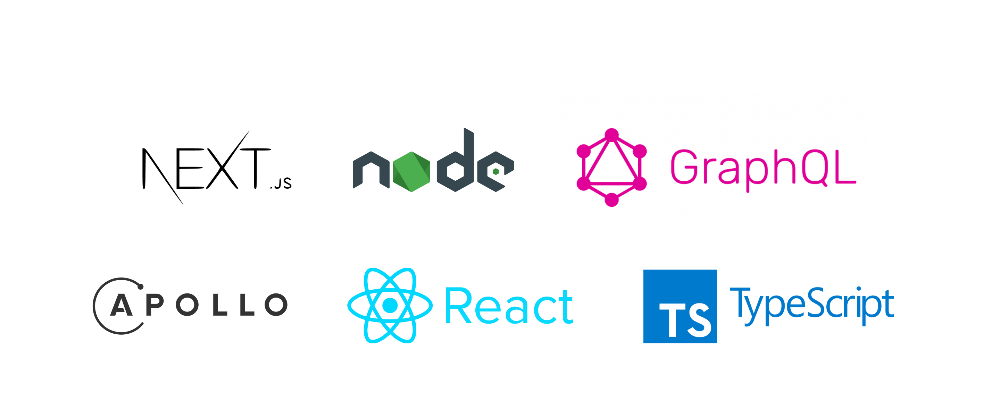

## LIGHTFILMS

**Live preview [LIGHTFILMS]** \
**Deployed thanks to [Vercel]**

**GraphQL LIGHTFILMS [API]** \
**GraphQL API deployed thanks to [Heroku]** \
**Database: [Firebase]**

## Documentation

- [NodeJS] - Node.js® is a JavaScript runtime built on Chrome's V8 JavaScript engine.
- [ReactJS] - A JavaScript library for building user interfaces
- [NextJS] - The React Framework for Production
- [Firebase] - Database
- [GraphQL] - A query language for API
- [TypeScript] - TypeScript extends JavaScript by adding types to the language.
- [SASS] - CSS Preprocessor
- [Figma] - Interface development

[NodeJS]: <https://nodejs.org/en/>
[API]: <https://lightfilms-api.herokuapp.com/graphql>
[ReactJS]: <https://reactjs.org/>
[NextJS]: <https://nextjs.org/>
[GraphQL]: <https://graphql.org/>
[Python3]: <https://www.python.org/>
[here]: <https://github.com/ssandry/lightfilms/blob/main/md/scripts.md>
[LIGHTFILMS]: <https://lightfilms-ssandry.vercel.app/>
[Vercel]: <https://vercel.com/home>
[TypeScript]: <https://www.typescriptlang.org/>
[SSR]: <https://habr.com/en/post/526828/>
[SASS]: <https://sass-scss.ru/>
[Heroku]: <https://www.heroku.com/>
[Firebase]: <https://firebase.google.com/>
[Figma]: <https://www.figma.com/>
